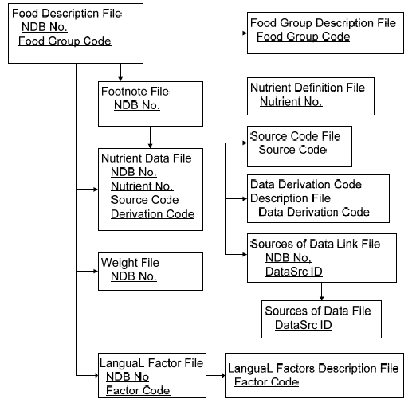

# FDA Database

We can get the information of the Food Composition Database from [here](https://ndb.nal.usda.gov/ndb/search/list?home=true). The problem is the updated database (and all its contain) is not longer in that page. From the page that I’ve already mentioned, we can get two databases:

## <u>BFPD Database<u/>
Branded Food Products Database.

### Tables
We have 4 tables that we can sumarize below.

#### Derivation_Code_Description

| Field name                  | Description                                           | Notes |
|-----------------------------|-------------------------------------------------------|-------|
| Derivation_Code             | A code indicating how the output value was determined |       |
| Derivation_Code_Description | Description of the derivation code                    |       |

#### Nutrient

| Field name      | Description                                           | Notes |
|-----------------|-------------------------------------------------------|-------|
| NDB_No          | 8-digit Nutrient that identifies a food item          |       |
| Nutrient_Code   | 3-digit identifier code for a nutrient                |       |
| Nutrient_Name   | Name of nutrient                                      |       |
| Derivation_Code | A code indicating how the Output_Value was determined |       |
| Output_Value    | Amount in 100 g, edible portion                       |       |
| Output_UOM      | Units of measure                                      |       |

#### Products

| Field name         | Description                                  | Notes                                                                                                                                                                                                                                                                                                                                                                                                                 |
|--------------------|----------------------------------------------|-----------------------------------------------------------------------------------------------------------------------------------------------------------------------------------------------------------------------------------------------------------------------------------------------------------------------------------------------------------------------------------------------------------------------|
| NDB_No             | 8-digit Nutrient that identifies a food item |                                                                                                                                                                                                                                                                                                                                                                                                                       |
| Long_Name          | Description of food item                     |                                                                                                                                                                                                                                                                                                                                                                                                                       |
| ~~Data_Source~~    | A code designating the source of the data    |                                                                                                                                                                                                                                                                                                                                                                                                                       |
| GTIN_UPC           | A code which identify the product            |                                                                                                                                                                                                                                                                                                                                                                                                                       |
| Manufacturer       | The company that manufactured the product    |                                                                                                                                                                                                                                                                                                                                                                                                                       |
| ~~Date_Modified~~  | Date when the food record was last updated   |                                                                                                                                                                                                                                                                                                                                                                                                                       |
| ~~Date_Available~~ | Date when the food record was available      |                                                                                                                                                                                                                                                                                                                                                                                                                       |
| Ingredients        | Ingredients of the product                   | Example: `ICE CREAM INGREDIENTS: MILK, CREAM, SUGAR, STRAWBERRIES (STRAWBERRIES,  SUGAR), CORN SYRUP SOLIDS, SKIM MILK, WHEY, NATURAL FLAVOR, GUAR GUM, MONO &  DIGLYCERIDES, BEET JUICE AND BEET POWDER (FOR COLOR), CELLULOSE GUM, LOCUST  BEAN GUM, CARRAGEENAN. COATING INGREDIENTS: SUGAR, WATER, RICE FLOUR, TREHALOSE,  EGG WHITES, BEET JUICE AND BEET POWDER (FOR COLOR), DUSTED WITH CORN &  POTATO STARCH` |

#### Serving_Size

| Field name   | Description                              | Notes                                      |
|--------------|------------------------------------------|--------------------------------------------|
| NDB_No       | 8-digit code that identifies a food item |                                            |
| Serving_Size | Weight of the sepcified serving          | pieze, tsp, tbsp, cup, onz, slice, pack... |

## <u>SR Legacy Database<u/>

Standard Reference Legacy Database

The downloaded files are:
  - *SR_Legacy.accdb*: Microsoft Access Database with all the information inside (8 tables)
  - *SR-Legacy_Doc.pdf*: explain all the information. Also, inside it we can find the source of the information, that we can get from [here](https://www.ars.usda.gov/northeast-area/beltsville-md-bhnrc/beltsville-human-nutrition-research-center/nutrient-data-laboratory/docs/sr28-download-files/). PROBLEM: All the data is in a Microsoft Access format, that we can open with programs like MDB Viewer (MAC), Microsoft Visual Studio 2017, Microsoft Access 2016 and so on.

### Tables

We have 8 tables that we can sumarize below.

| Table information                | Table name | Number of records | Role      | PK                  |
|----------------------------------|------------|-------------------|-----------|---------------------|
| Food description                 | FOOD_DES   | 8790              | Principal | NDB_No              |
| Nutrient data                    | NUT_DATA   | 679238            | Principal | NDB_No, Nutr_No     |
| Weight                           | WEIGHT     | 15439             | Principal | NDB_No, Seq         |
| Footnote                         | FOOTNOTE   | 552               | Principal | NDB No              |
| Food Group Description           | FD_GROUP   | 25                | Support   | FdGrp_Cd            |
| LanguaL factor                   | LANGUAL    | 38301             | Support   | NDB_No, Factor_Code |
| LanguaL factor Description       | LANGDESC   | 774               | Support   | Factor_Code         |
| Nutrient Definition              | NUTR_DEF   | 150               | Support   | Nutr_No             |
| ~~Source Code~~                  | SRC_CD     | 10                | Support   | Src_Cd              |
| Data Derivation Code Description | DERIV_CD   | 55                | Support   | Deriv_Cd            |
| ~~Sources of Data Link~~         | DATSRCLM   | 224496            | Support   | NDB_No, Nutr_No     |
| ~~Sources of Data~~              | DATA_SRC   | 682               | Support   | DataSrc_ID          |
| Abbreviated                      | ABBREV     | 8790              | Principal | NDB_No              |

> *Note: The number of records is not correct in the documentation file (only a few tables have the correct number of records)*

As we are working with a relational data base, there are relations within the tables. We can see them in the next picture.

#### Food description

| Field name  | Description                                                                                                                                       | Notes |
|-------------|---------------------------------------------------------------------------------------------------------------------------------------------------|-------|
| NDB_No      | 5-digit Nutrient Database number. It identifies a food item                                                                                       |       |
| FdGrp_Cd    | 4-digit number. It identifies the food group to which a food item belongs                                                                         |       |
| Long_Desc   | Description of the food items. Example: `Cheese, cottage, creamed, large or small curd`                                                           |       |
| Short_Desc  | Abbreviated Description of the food items (from Long_Desc attribute). Example: `CHEESE,COTTAGE,CRMD,LRG OR SML CURD`                              |       |
| ComName     | Other names to describe a food (in regions for example)                                                                                           |       |
| ManufacName | Name of the company                                                                                                                               |       |
| ~~Survey~~  | If the food item is used in the FNDDS                                                                                                             |       |
| Ref_desc    | Description of inedible parts of a food item (example: bone). Example: `23% Bone and connective tissue, 11% Separable fat` or `Connective tissue` |       |
| Refuse      | Percentage of refuse by weight                                                                                                                    |       |
| ~~SciName~~ | Scientific name of the food item                                                                                                                  |       |
| N_Factor    | Factor for converting nitrogen to protein amounts                                                                                                 |       |
| Pro_Factor  | Factor for calculating calories from protein amounts                                                                                              |       |
| Fat_Factor  | Factor for calculating calories from fat levels                                                                                                   |       |
| CHO_Factor  | Factor for calculating calories from carbohydrate values                                                                                          |       |

#### Nutrient Data

| Field name       | Description                                                     | Notes |
|------------------|-----------------------------------------------------------------|-------|
| Nutr_No          | 5-Digit Nutrient Database number that identifies a food item    |       |
| Nutr_Val         | 3-digit number that identifies a nutrient                       |       |
| ~~Num_Data_Pts~~ | Number of analyses used to calculate the nutrient value         |       |
| Std_Error        | Standard error of the mean                                      |       |
| Src_Cd           | Type of data                                                    |       |
| Deriv_Cd         | Information on how the value is determined                      |       |
| ~~Ref_NDB_No~~   | number of the item used to calculate a missing  value           |       |
| Add_Nutr_Mark    | Vitamin or mineral added for fortification or  enrichment       |       |
| ~~Num_Studies~~  | Number of s                                                     |       |
| Min              | Minimum value                                                   |       |
| Max              | Maximum value                                                   |       |
| ~~DF~~           | Degrees of freedom (computed using Satterwaite's approximation) |       |
| ~~Low_EB~~       | Lower 95% error bound.                                          |       |
| ~~Up_EB~~        | Upper 95% error bound.                                          |       |
| ~~Stat_cmt~~     | Statistical comments                                            |       |
| ~~AddMod_Date~~  | When value was added to the database or was last  modified      |       |

#### Weight

| Field name   | Description                                                       | Notes                                                                            |
|--------------|-------------------------------------------------------------------|----------------------------------------------------------------------------------|
| NDB_No       | 5-digit. It identifies a food item                                |                                                                                  |
| ~~Seq~~      | Sequence number                                                   |                                                                                  |
| Amount       | Unit                                                              | Example: value **1** means: 1 cup, or 1 slize, 1 oz, 1 package...                |
| Msre_Desc    | Measure description, the measure we are using for each food item: | Example: cup, oz, pat, stick, tbsp,.. . Sometimes, fuzzy measures: small, medium.... |
| Gm_Wgt       | Gram weight                                                       | Float number                                                                     |
| Num_Data_Pts | Number of data points                                             | Natural number                                                                   |
| Std_Dev      | Standard deviation                                                | Float number                                                                     |

#### Footnote

| Field name | Description                                                                                    | Notes |
|------------|------------------------------------------------------------------------------------------------|-------|
| NDB_NO     | 5-Digit Nutrient Database number that identifies a food item                                   |       |
| Footnt_No  | Sequence number                                                                                |       |
| Footnt_Typ | If a given footnote applies to more than one nutrient number, the same footnote number is used |       |
| Nutr_No    | Unique 3-digit identifier code for a nutrient to which footnote applies                        |       |
| Footnt_Txt | Text                                                                                           |       |

#### Food Group Description

| Field name | Description                                                                 | Notes |
|------------|-----------------------------------------------------------------------------|-------|
| FdGrp_Cd   | 4-Digit code. It identifies a food group                                    |       |
| FdGrp_Des  | Name of the group. Examples: `Poultry Products`, `Snacks`, `Fast Foods`,... |       |

#### LanguaL factor

| Field name  | Description                                 | Notes |
|-------------|---------------------------------------------|-------|
| NDB_No      | 5-Digit number. It identifies a food item.  |       |
| Factor_Code | LanguaL factor from the LanguaL thesaurus   |       |

#### LanguaL factor Description

| Field name  | Description                                 | Notes |
|-------------|---------------------------------------------|-------|
| Factor_Code | LanguaL factor from the LanguaL thesaurus   |       |
| Description | Description of the LanguaL Factor Code      |       |

#### Nutrient Definition

| Field name   | Description                                                  | Notes        |
|--------------|--------------------------------------------------------------|--------------|
| Nutr_No      | 5-Digit Nutrient Database number that identifies a food item |              |
| Units        | Units of measure                                             | Mg, g and μg |
| ~~Tagname~~  | International Network of Food Data Systems tagname           |              |
| NutrDesc     | Name of nutrient                                             |              |
| Num_Dec      | Number of decimals (rounded)                                 |              |
| ~~SR_Order~~ | Used to sort nutrient records                                |              |

#### Source Code

| Field name | Description                                                              | Notes |
|------------|--------------------------------------------------------------------------|-------|
| Src_Cd     | 2-digit code indicating type of data                                     |       |
| SrcCd_Desc | Descripcion of source code that identifies the type of the nutrient data |       |

#### Data Derivation Code Description

| Field name | Description                                                     | Notes   |
|------------|-----------------------------------------------------------------|---------|
| Deriv_Cd   | Derivation code                                                 |         |
| Deriv_Desc | Description of derivation code and how the value was determined | useful? |

#### Sources of Data Link

##### (Not useful)

| Field name     | Description                                                  | Notes |
|----------------|--------------------------------------------------------------|-------|
| NDB_NO         | 5-Digit Nutrient Database number that identifies a food item |       |
| Nutr_No        | 3-Digit identifier for a nutrient                            |       |
| ~~DataSrc_ID~~ | Unique ID identifying the reference/source                   |       |

#### Sources of Data
##### (Not useful)

| Field name  | Description                                            | Notes |
|-------------|--------------------------------------------------------|-------|
| DataSrc_ID  | Identification number for the reference/source         |       |
| Authors     | Authors of journal articles                            |       |
| Title       | Title of article                                       |       |
| Year        | Year of publication                                    |       |
| Journal     | Name of the journal in which the article was published |       |
| Vol_City    | Volume number for journal articles, books, reports,... |       |
| Issue_State | Issue number for journal articles                      |       |
| Start_Page  | Starting page number of article/document               |       |
| End_Page    | Ending page number of article/document                 |       |

#### Abbreviated

| Field name | Description                               | Notes |
|------------|-------------------------------------------|-------|
| NDB_No     | 5-digit. It identifies a food item        |       |
| Shrt_Desc  | Abbreviated Description of the food items |       |
| Water      | Water (g/100 g)                           |       |
| Energ_Kcal | Food energy (kcal/100 g)                  |       |
| Protein    | Protein (g/100 g)                         |       |
| Lipid_Tot  | Total lipid (fat) (g/100 g)               |       |
| Ash        | Ash (g/100 g)                             |       |
| Carbohydrt | Carbohydrate, by difference (g/100 g)     |       |
| Fiber_TD   | Total dietary fiber (g/100 g)             |       |
| Sugar_Tot  | Total sugars (g/100 g)                    |       |
| Calcium    | Calcium (mg/100 g)                        |       |
| Iron       | Iron (mg/100 g)                           |       |
| Magnesium  | Magnesium (mg/100 g)                      |       |
| Phosphorus | Phosphorus (mg/100 g)                     |       |
| Potassium  | Potassium (mg/100 g)                      |       |
| Sodium |   Sodium (mg/100 g)                           |       |
| Zinc |  Zinc (mg/100 g)                                |       |
| Copper | Copper  (mg/100 g)                            |       |
| Manganese | Manganese (mg/100 g)                       |       |
| Selenium | Selenium (μg/100 g)                         |       |
| Vit_C | Vitamin C  (mg/100 g)                          |       |
| Thiamin | Thiamin (mg/100 g)                           |       |
| Riboflavin | Riboflavin (mg/100 g)                     |       |
| Niacin | Niacin (mg/100 g)                             |       |
| Panto_acid | Pantothenic acid (mg/100 g)               |       |
| Vit_B6 | Vitamin B6 (mg/100 g)                         |       |
| Folate_Tot  |  Folate, total (μg/100 g)                |       |
| Folid_acid  | Folid acid (μg/100 g)                    |       |
| Food_Folate | Food folate (μg/100 g)                   |       |
| Folate_DFE | Folate (μg dietary folate equivalents /100 g)|       |
| Choline_Tot | Choline, total (mg/100 g)                |       |
| Vit_B12 | Vitamin B12 (μg/100 g)                       |       |
| Vit_A_IU  | Vitamin A  (IU/100 g)                      |       |
| Vit_A_RAE | Vitamin A  (μg retinol activity equivalents/100 g)  |       |
| Retinol | Retinol (μg/100 g)                           |       |
| Alpha_Carot | Alpha-carotene (μg/100 g)                |       |
| Beta_Carot | Beta-carotene  (μg/100 g)                 |       |
| Beta_Crypt | Beta-cryptoxanthin (μg/100 g)             |       |
| Lycopene | Lycopene (μg/100 g)                         |       |
| Lut+Zea | Lutein+zeazanthin (μg/100 g)                 |       |
| Vit_E | Vitamin E (alpha-tocopherol) (mg/100 g)        |       |
| Vit_D_mcg |  Vitamin D (μg/100 g)                      |       |
| Vit_D_IU | Vitamin D (IU/100 g)                        |       |
| Vit_K | Vitamin K (μg/100 g)                           |       |
| FA_Sat | Saturated fatty acid (g/100 g)                |       |
| FA_Mono | Monounsaturated fatty acids  (g/100 g)       |       |
| FA_Poly | Polyunsaturated fatty acids  (g/100 g)       |       |
| Cholestrl | Cholesterol (mg/100 g)                     |       |
| GmWt_1 | First household weight for this item from theWeight file. |       |
| GmWt_Desc1 | Description of household weight number 1. |       |
| GmWt_2 | Second household weight for this item from the Weight file. |       |
| GmWt_Desc2 | Description of household weight number 2. |       |
| Refuse_Pct | Percent refuse.                           |       |

## References:

https://ndb.nal.usda.gov/ndb/search/list?home=true

https://www.ars.usda.gov/northeast-area/beltsville-md-bhnrc/beltsville-human-nutrition-research-center/nutrient-data-laboratory/docs/sr28-download-files/
